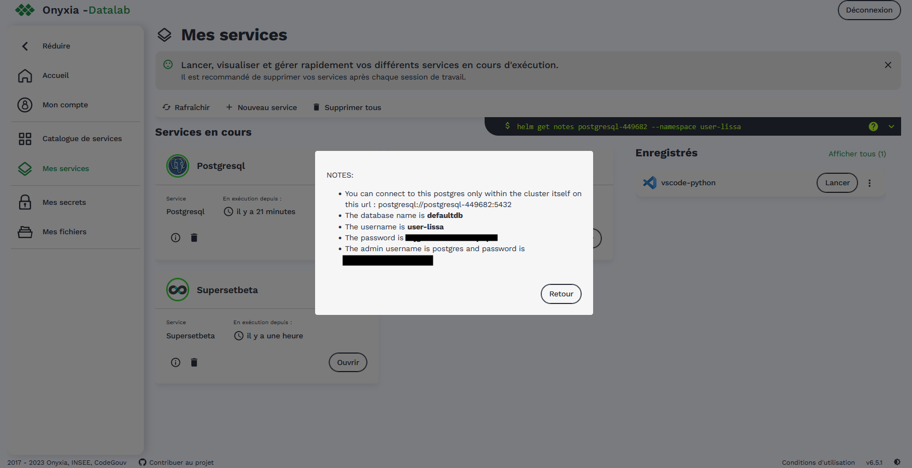

Cas d'usages Nubonyxia 
=====================

.. _firstcase:

**Cas Usage 1**: Déployer des applications via une pipeline CI/CD
----------------------------------------------------------------

.. important::

    Dans sa conception actuelle, `Nubonyxia`_ ne gère pas la mise en production des applicatifs webs déployés sur la plateforme. Si vous souhaitez péréniser une application déployée sur notre plateforme, adressez-vous directement à nous. 

Cette section décrit les étapes dans le déploiement d'une application développée en 
  * **R** avec la librairie `r shiny <https://shiny.posit.co>`_
  * **Python** avec la librairie `streamlit <https://streamlit.io>`_

Prérequis pour exécution d'un pipeline GitLab-CI
################################################

Les templates à utiliser sont disponibles pour `Python <https://forge.dgfip.finances.rie.gouv.fr/bercyhub/nubonyxia/nubonyxia-python-app-example>`_ et `R <https://forge.dgfip.finances.rie.gouv.fr/bercyhub/nubonyxia/nubonyxia-r-app-example>`_ 
Il suffit de forker le repo qui vous intéresse et d'ajouter vos scripts dans le dossier *app*.

 
1. Configuration Onyxia
***********************
Pour le bon fonctionnement du pipeline décrit dans le fichier :file:`.gitlab-ci.yml`, il est nécessaire de respecter une certaine **convention de configuration**.

a. Mes secrets 
+++++++++++++++

Dans `Mes Secrets <https://nubonyxia.incubateur.finances.rie.gouv.fr/my-secrets/>`_ de votre compte `NubOnyxia`_, il doit y avoir un **secret**, par défaut choisissez comme nom `registries`. Dans ce secret, définissez deux variables :

* :python:`USERNAME` correspond à votre `username` présent dans le menu **User Profile** de `Harbor`_
* :python:`PASSWORD` correspond à votre `CLI secret` présent dans le menu **User Profile** de `Harbor`_

b. Runners
+++++++++++

Les jobs d'un pipeline **GitLab-CI** sont pris en charge et exécutés par un ou plusieurs `GitLab-Runners`. Il est possible de voir les runners actifs au niveau des paramètres du CI/CD du projet GitLab dans :menuselection: `Settings --> CI/CD --> Runners`. Une ligne avec un point vert apparaît si un runner est détecté.

Si aucun runner n'est détecté, il faut en créer un. Pour cela, depuis la plateforme Onyxia, il est possible de lancer un service `GitLab-Runner`,dans le catalogue :menuselection:`Automation Services`. Dans le paramétrage du service, il y a plusieurs champs à compléter : 

- dans l'onglet :menuselection:`Cache`, il faut remplir les champs :python:`AccessKey` et :python:`SecretKey` avec les clés d'accès à son bucket `MinIO`_ , qui sera utilisé pour stocker les artefacts entre les différents jobs dans la pipeline. La section :ref:`miniokeys` dans la page :doc:`minio` explique comment créer les clés d'accès `MinIo`_ pour la première fois. 

- dans l'onglet :menuselection:`Registration` dans la création du Gitlab runner, il faut renseigner le :python:`Registration token` qui est trouvable dans GitLab :menuselection:`Settings --> CI/CD --> Runners` du projet, cliquer sur les trois petits points à côté du bouton bleu `New project runner`.

- vous pouvez ensuite lancer votre `gitlab-runner`.

2. Configuration GitLab
***********************

a. Variables de projet
++++++++++++++++++++++
Il faut créer la variable :python:`VAULT_TOKEN` depuis le menu :menuselection:`Settings --> CI/CD --> Variables` de votre projet GitLab : 

- :python:`VAULT_TOKEN` correspond à la valeur **Vault Token** précisée dans :menuselection:`Mon compte --> Vault` de la plateforme `NubOnyxia`_. Cochez `protected` et `masked`.

b. Fichier :file:`gitlab-ci.yml`
+++++++++++++++++++++++++++++++++
Dans votre fichier `.gitlab-ci.yml`, il faut renseigner plusieurs variables :

- :python:`NUBONYXIA_ID` correspond à votre identifiant `Nubonyxia`_ disponible dans `Mon Compte <https://nubonyxia.incubateur.finances.rie.gouv.fr/account>`_ de la plateforme `NubOnyxia`_

- :python:`NUBONYXIA_REGISTRY_SECRET` : par défaut, valeur à définir à `registries`, correspond au nom du secret créé précédemment [Mes Secrets](#mes-secrets)

- :python:`REGISTRY_PROJECT` : durant l'étape de **deliver**, l'image générée dans l'étape **build** sera publiée dans `Harbor`_ dans le *registre* précisé dans cette variable. S'il n'existe pas dans Harbor, ll faut le créer (`Nouveau projet`).

- :python:`REGISTRY_PROJECT_PUBLIC_ACCESS` : le registre du projet est considéré comme privé par défaut (ie `REGISTRY_PROJECT_PUBLIC_ACCESS: "false"`). Si le registry est public, il faut mettre cette variable à `true`.

- :python:`USE_HELM` : la valeur doit être à `true`.

- :python:`APPLICATION_NAME` : cette variable définit le nom d'application, cette variable a peu d'impact et sera visible dans `Harbor`_ dans le registre. Cette variable doit être composée de caractères alphanumériques minuscules.

- :python:`CHART_NAME` : le nom du chart utilisé pour déploiement de l'application. Vous pouvez laisser la valeur par défaut `demo`. Si vous changez cette valeur, il faudra également changer la valeur dans le fichier `chart/Chart.yml`.

c. Fichier :file:`values.yaml`
++++++++++++++++++++++++++++++
Dans le fichier: 

- :menuselection:`imagePullSecrets --> name`: mettre le même nom que :python:`NUBONYXIA_REGISTRY_SECRET` (ex : `registries`)

- :menuselection:`ingress --> hosts --> host` : il faut choisir une URL pour votre application.

d. Dockerfile
+++++++++++++

.. tab-set::

    .. tab-item:: R

        Dans le fichier, ajouter les dépendances **R** à installer dans la fonction `install.packages`. 

                
        .. code:: R

          install.packages()
          

    .. tab-item:: Python

        Voici un exemple type de dockerfile pour une application python, à adapter selon le cas d'usage. 
        
        .. code:: python

          FROM python:3.10.10-slim-buster

          COPY app /app/
          COPY pip /tmp/pip/
          WORKDIR /app

          RUN pip install --no-index -r /tmp/pip/requirements.txt --find-links=/tmp/pip/

          ENTRYPOINT ["python"]

          CMD ["app.py"]

3. Configuration Kubernetes
***************************

Il faut ajouter un secret dans `Kubernetes <https://kubernetes.io/fr/>`_. Pour cela, ouvrir un service **VSCode** dans Onyxia, en prenant soin dans l'onglet :menuselection:`Kubernetes` de choisir le mode admin. Puis ouvrir un terminal dans VSCode et exécuter les commandes suivantes: 

.. code:: bash

    HARBOR_AUTH=$(echo -n "HARBOR_USERNAME:HARBOR_PASSWORD" | base64)
    cat <<EOF > dockerconfig.json
    {"auths":
      {"harbor.lab.incubateur.finances.rie.gouv.fr": {"auth": "<HARBOR_AUTH>"}
    }}
    EOF

en remplaçant :python:`HARBOR_USERNAME` et :python:`HARBOR_PASSWORD` par leurs valeurs. Puis : 

.. code:: bash

  kubectl create secret generic registries \
  --from-literal=AWS_DEFAULT_REGION=us-east-1 \
  --from-literal=AWS_S3_ENDPOINT="minio.lab.incubateur.finances.rie.gouv.fr" \
  --from-literal=AWS_ACCESS_KEY_ID="MyAccessKey" \
  --from-literal=AWS_SECRET_ACCESS_KEY="MySecretKey"

où **MyAccessKey** et **AWS_SECRET_ACCESS_KE** correspondent aux clés `MinIO`_ crées lors de sa première connexion, voir la section :ref:`miniokeys`.

Exécution de la pipeline
########################

Une fois tous les prérequis remplis, la pipeline devrait se lancer automatiquement. Il est possible de voir son exécution dans l'onglet "Build" puis "Pipelines". Si tout se passe bien, chaque étape sera marquée d'une coche verte. Sinon, se reporter à la partie suivante.

Commande pour debugger 
########################
.. _commandKubectl:

.. code:: bash
  
  kubectl get pods                          #pour voir les pods en fonctionnement
  kubectl delete pod <name_pod>              #pour supprimer un pod
  kubectl get deployment                    #pour voir les déploiements
  kubectl delete deployment deployment_name #pour supprimer un déploiement
  kubectl logs pod_name                     #pour voir les logs d'un pod.

Partage d'une application R shiny depuis `Nubonyxia`_
######################################################
Pour partager rapidement une application RShiny, il est possible de lancer un *server* depuis son service **RStudio** et de partager une URL.

Pour cela, il faut :

* lancer un service **RStudio** en prenant soin d'activer le port Custom dans l'onglet Networking
* activer les options suivantes dans votre code :

.. code:: R

  options(shiny.host = '0.0.0.0')
  options(shiny.port = 5000) # mettre le port que vous avez choisi dans Onyxia
  options(shiny.launch.browser = FALSE)

* lancer votre code dans **RStudio**
* obtenir le lien dans `Nubonyxia`_ en cliquant sur le bouton :menuselection:`Readme de votre service

Un exemple de code :

.. code:: R

  library(shiny)

  options(shiny.host = '0.0.0.0') 
  options(shiny.port = 5000)  
  options(shiny.launch.browser = FALSE)

  ui <- fluidPage(
  # Application title
  titlePanel("Hello, World! Shiny App")

  )

  # Define server logic
  server <- function(input, output) {
  
  }

  shinyApp(ui, server)

**Cas Usage 2** : Data Visualisation avec :python:`Superset` 
-------------------------------------------------------------

Cette section présente quelques cas d’usage simple de :python:`Superset` et vous accompagne dans votre première utilisation. En particulier, la configuration du service sera détaillée. Il ne s’agit pas d'un guide extensif du service mais plutôt d'une prise en main de l'outil dans l’écosystème Nubonyxia. 

Configuration de :python:`Superset`  
########################

Création d'une DataBase 
***********************

Il faut se rendre dans :menuselection:`Settings --> Data --> database Connections`. Puis cliquer sur :python:`+ database`. Dans la suite, nous allons connecter la Database au serveur de base de données :python:`PostgreSQL` disponible dans le catalogue de services. 
Avant de poursuivre, vérifiez qu'un service :python:`PostgreSQL` est disponible dans `Mes services <https://nubonyxia.incubateur.finances.rie.gouv.fr/my-services/>`_. 

Ensuite, les options de configuration sont les suivantes: 

* **Host** : de la forme `postgresql-826506` 

* **Port** : par exemple 5432

* **Username**

* **Password** 

Pour les compléter, s'appuyer sur le **README** du service :python:`PostgreSQL` ouvert, comme le montre :numref:`connectDataBase`.

.. _connectDataBase:

  **README** d'une instance PostgreSQL lancée sur la plateforme

.. warning:: 

  Pour autoriser le téléversement de fichiers CSV, se rendre dans :menuselection:`Dans Advanced-->Security` Puis cochez `Allow file uploads to database`

Préparation d'un dataset 
***********************

.. role:: sql(code)
   :language: sql

Dans l’onglet :python:`Datasets` sont listés les datasets récupérés depuis une base de donnée ou importés. Il est possible de modifier les propriétés des colonnes d'un dataset dans :python:`Edit/Columns`.

* Définir une colonne métrique comme colonne à partir de requêtes SQL agrégeant des valeurs issues de plusieurs colonnes:  :sql:`SUM()`, :sql:`AVG()`, etc. 
* Modifier une colonne dans **Calculates Columns** avec des commandes SQL telles que :sql:`CAST(recovery_rate) as float`

.. warning::

  Les fonctions d’agrégation ne sont pas autorisées dans `Calculated Columns`

Production d'un Dashboard 
########################

:python:`Superset` autorise deux modes exploratoires : 

* **Chart**, un *no-code viz-builder* qui permet la production de grahiques de façon interactive et agnostique vis-à-vis du code.  
* **SQL Lab** qui offre une interface SQL pour visualiser les datasets importés, faire des jointures et les préparer en vue de générer des *Charts* 

Pour le premier, il suffit de cliquer sur le nom du dataset pour lancer la création d’un chart.
Pour le second, il faut se rendre dans :menuselection:`SQL --> SQL lab`. La requête SQL permet de générer un nouveau dataset qu'on peut enregistrer et qui peut servir à la création d'un *Chart*. 
Une fois son chart réalisé, on peut l’enregistrer dans un *Dashboard*. Ce dernier permet d'explorer de façon dynamique et intéractive les différents graphiques ou *charts* crées à partir des *datasets*. 

.. note::
  Il est possible de télécharger le *dashboard* en pdf ou en image. A noter qu'il est préférable de le partager afin de garder l'interface intéractive (voir section :ref:`collab`)

Illustration avec les données du Plan de Relance 
************************************************

Les données sur le `Plan de Relance <https://www.economie.gouv.fr/plan-de-relance>`_ sont ouvertes et disponibles sur la plateforme `data.economie.gouv <https://data.economie.gouv.fr/explore/dataset/plan-de-relance/table/>`_. 

Il est possible d'importer un fichier csv dans la *database* en cliquant sur :python:`+` puis en sélectionnant dans le menu :menuselection:`Data --> Upload CSV to database`. Dans notre exemple, sur la fenêtre qui s'affiche, choisir comme :python:`Delimiter` **Other**. 

On peut visualiser les données dans :python:`SQL Lab`. Pour ce faire il faut sélectionner la table de donnée importée dans le menu *See Table Schema*, comme l'illustre :numref:`SQL`.

.. _SQL:

.. figure:: images/supersetSQL.png
  :width: 800
  :alt: Alternative text

  Le SQL Lab de :python:`superset`

Ensuite, la création de *charts* se fait de manière intéractive comme le montre la figure :numref:`Chart`. 

.. _Chart:

.. figure:: images/supersetCharts.png
  :width: 800
  :alt: Alternative text

  Exemple d'un *chart*

Enfin, on enregistre le *chart* dans un *dashboard* qu'on peut éditer et partager. 

Voici un exemple de dashboard avec les données de data.gouv.economie sur le Plan de Relance: 

.. _Dashboard:
.. figure:: images/superset.png
  :width: 800
  :alt: Alternative text

  Exemple de dashboard 

.. note::
  Pour créer une carte, :python:`superset` nécessite les codes ISO-3166-2 des régions et départements, comme l'indique la `documentation de superset <https://superset.apache.org/docs/configuration/country-map-tools/>`_. Pour créer la carte présente dans le dashboard figurant dans :numref:`Dashboard`, nous avons importée une table supplémentaire, construite à partir de plateforme en ligne `ISO <https://www.iso.org/obp/ui/#iso:code:3166:FR>`_ que l'on a joint à la table initiale. 

.. _collab:

Collaborer sur :python:`Superset`: partage d'un Dashboard 
#########################################################

Le service :python:`Superset` permet la **gestion des utilisateurs** pour les productions du service. Ainsi, il est possible de définir les propriétés d'accès aux différents *dashboards* et *datasets* en déterminant les utilisateurs qui pourront collaborer ou simplement consulter. 

Pour ajouter un nouvel utilisateur du service, il faut se rendre dans :menuselection:`Settings --> List Users`, ce qui amène à la page 
:numref:`Users`. Cliquer ensuite sur :python:`Add a new record` pour ajouter un nouvel utilisateur. Comme le montre :numref:`addUser`, on peut attribuer un *role* à un utilisateur. 

.. _addUser:

.. figure:: images/SupersetAddUser.png
   :width: 45%

   Ajout d'un utilisateur 

.. _Users:

.. figure:: images/SupersetgestionUser.png
   :width: 45%

   Gestion des utilisateurs 

.. note::
  Pour connaître la différence entre les différents *roles*, se rendre dans :menuselection:`Settings --> List Roles`. Il y est également possible de modifier les attributs associés et de définir un nouveau *role*. 

Dans :python:`Dashboard`, placer la souris sous le champ :python:`Action` puis cliquer sur l'icône pour modifier. Une nouvelle fenêtre apparaît (voir :numref:`DashboardShare`) dans laquelle on peut ajouter le nouvel utilisateur défini précédemment comme :python:`Owners`. Ce dernier pourra alors collaborer sur la réalisation du *Dashboard*. 

.. _DashboardShare:

.. figure:: images/SupersetDashboardShare.png
  :width: 800
  :alt: Alternative text

  Modification des propriétés du *Dashboard*

**Cas Usage 3** : IA Générative  
-------------------------------

